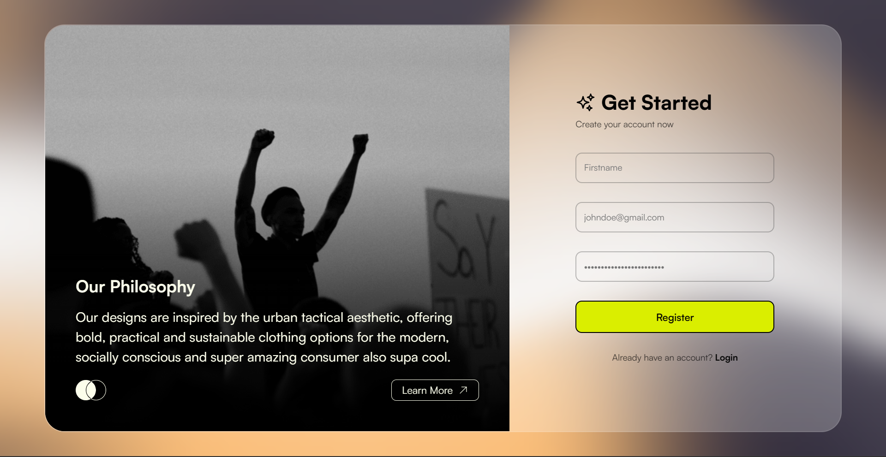
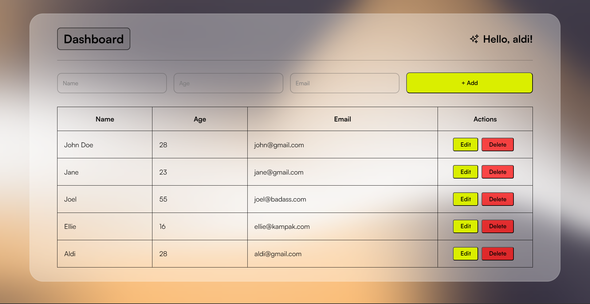

# Login/Register Website

POTA is a fictional fashion brand that was built with the primary goal of learning how to implement a CRUD system for handling register and login form on a website. By building POTA, I have gained valuable experience in various aspects of web development and CRUD operations. I have learned how to create a registration and login system, allowing users to create accounts, log in, and access their dashboard. I have also learned how to implement a dashboard page, which provides users with data that they can edit, create and delete.

## :hammer_and_wrench: Tech Stack

